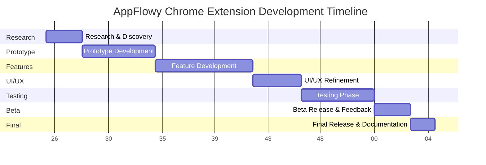

# Detailed Plan for AppFlowy Chrome Extension Development

## Objective Review
The goal is to develop a Chrome extension for AppFlowy that enables users to scrape the current web page, including its URL, metadata (such as title, author, and publication date if available), and content, and add it to AppFlowy with a single click. This extension will integrate seamlessly with AppFlowy's workspace structure, providing a powerful tool for users to save and organize web content directly into their AppFlowy environment, rivaling the capabilities of tools like Notion and Obsidian.

## Feature Breakdown
Below is a detailed breakdown of the key features outlined in `bootstrap-prompt.md`, including implementation strategies, potential challenges, and user benefits:

- **One-Click Capture**:
  - **Implementation**: Develop a toolbar icon and context menu entry that triggers a content script to scrape the current page upon click. Use Chrome's extension APIs to access page content.
  - **Challenges**: Ensuring the capture works across diverse web page structures and handles dynamic content loaded via JavaScript.
  - **User Benefits**: Simplifies the process of saving web content, making it accessible with minimal effort.

- **Destination Control**:
  - **Implementation**: Create a popup interface using HTML/CSS/JavaScript within the extension to allow users to select specific AppFlowy workspaces or pages. This requires integration with AppFlowy's API or data structure.
  - **Challenges**: Determining the best method to authenticate and connect to AppFlowy, especially if API access is limited or varies between local and cloud setups.
  - **User Benefits**: Enables organized storage of clipped content, tailored to the user's existing AppFlowy structure.

- **Precision Clipping**:
  - **Implementation**: Implement a selection tool within the content script that allows users to highlight text, images, or specific DOM elements. Use CSS selectors or XPath to capture selected content accurately.
  - **Challenges**: Handling complex DOM structures and ensuring selections are preserved across different websites with varying layouts.
  - **User Benefits**: Offers flexibility to save only relevant content, reducing clutter in AppFlowy.

- **Metadata Inclusion**:
  - **Implementation**: Develop parsing logic to extract metadata from HTML meta tags, Open Graph protocol data, and other structured formats on the page. Use libraries like Cheerio (if bundled) for DOM parsing.
  - **Challenges**: Inconsistent metadata availability across websites; may require fallback strategies for missing data.
  - **User Benefits**: Provides context to saved content, making it easier to reference or search within AppFlowy.

- **Formatting Preservation**:
  - **Implementation**: Capture HTML structure and inline styles during scraping, converting them into a format compatible with AppFlowy's editor (e.g., markdown or rich text).
  - **Challenges**: Balancing fidelity to original formatting with AppFlowy's rendering capabilities; potential loss of complex CSS or JavaScript-driven layouts.
  - **User Benefits**: Enhances readability and usability of saved content within AppFlowy.

- **Annotation Support**:
  - **Implementation**: Add input fields in the popup interface for users to enter notes, tags, or comments before saving. Include these annotations as metadata or separate fields in the data sent to AppFlowy.
  - **Challenges**: Ensuring annotations are stored in a way that integrates well with AppFlowy's data model.
  - **User Benefits**: Allows users to add personal context or categorization, improving content organization.

## Development Phases
The development will be structured into distinct phases to ensure a systematic approach:

1. **Research and Discovery (2-3 weeks)**:
   - Investigate AppFlowy's integration options (API availability, local storage access, cloud sync mechanisms).
   - Study Chrome extension development best practices, focusing on content scripts, background scripts, and permissions.
   - Analyze existing web clipping extensions (Notion, Obsidian) for technical insights beyond user features.

2. **Prototype Development (4-6 weeks)**:
   - Develop a basic web scraping module to capture full page content and metadata.
   - Implement a minimal popup UI for initiating clipping and viewing results.
   - Test initial AppFlowy integration, focusing on data transfer (mock API if real API is unavailable).

3. **Feature Development (6-8 weeks)**:
   - Enhance scraping with precision clipping capabilities using DOM selection tools.
   - Build destination control in the popup, allowing workspace/page selection.
   - Add formatting preservation logic and annotation input fields.
   - Optimize performance for scraping and data handling on content-heavy pages.

4. **UI/UX Refinement (3-4 weeks)**:
   - Design an intuitive popup interface with preview options for clipped content.
   - Implement context menu access for quick clipping actions.
   - Add feedback mechanisms (notifications) for user confirmation post-save.

5. **Testing Phase (4-6 weeks)**:
   - Establish a comprehensive test framework including:
     - **Unit Tests**: For individual components like scraping logic, metadata extraction, and formatting conversion.
     - **Integration Tests**: For interactions between scraping, UI, and AppFlowy data transfer.
     - **End-to-End Tests**: Simulating complete user workflows (e.g., clipping a page, selecting destination, saving).
   - Set up automated test coverage using tools like Jest or Mocha, integrated with a CI/CD pipeline (e.g., GitHub Actions) to run tests on every code change.
   - Target at least 80% test coverage for critical components to ensure reliability.
   - Conduct manual testing across various websites (news, blogs, social media) to validate scraping accuracy and formatting.
   - Test security aspects, ensuring data privacy and minimal permissions usage.

6. **Beta Release and Feedback (2-3 weeks)**:
   - Release a beta version to a limited user group for real-world testing.
   - Collect feedback on usability, bugs, and feature requests to inform final adjustments.

7. **Final Release and Documentation (2 weeks)**:
   - Address feedback from beta testing, fixing critical issues.
   - Prepare comprehensive documentation for installation, usage, and troubleshooting.
   - Publish the extension to the Chrome Web Store.

## Timeline
The estimated total timeline is approximately 23-32 weeks, broken down as follows:
- Research and Discovery: Weeks 1-3
- Prototype Development: Weeks 4-9
- Feature Development: Weeks 10-17
- UI/UX Refinement: Weeks 18-21
- Testing Phase: Weeks 22-27
- Beta Release and Feedback: Weeks 28-30
- Final Release and Documentation: Weeks 31-32

This timeline assumes dependencies like AppFlowy API availability are resolved early. Delays in integration capabilities may extend the schedule.

## Technical Architecture
The high-level architecture of the AppFlowy Chrome Extension will consist of the following components:
- **Content Script**: Injected into web pages to scrape content, handle selections for precision clipping, and extract metadata. Communicates with the popup and background script.
- **Background Script**: Manages permissions, listens for context menu interactions, and handles any persistent logic or API authentication for AppFlowy if needed.
- **Popup UI**: A user interface built with HTML/CSS/JavaScript (potentially using frameworks like React if bundled) for selecting destinations, adding annotations, previewing content, and confirming saves.
- **AppFlowy Integration Module**: Handles data transfer to AppFlowy, using API calls or file system writes (for local setups), ensuring compatibility with AppFlowy's data model.
- **Testing Infrastructure**: Includes test suites (unit, integration, end-to-end) running via a framework like Jest, with coverage reports generated to monitor code quality.

Below is a Mermaid diagram illustrating the development phases:

This detailed plan provides a structured approach to developing the AppFlowy Chrome Extension, ensuring all features, user experience goals, and technical considerations are addressed systematically, with a strong emphasis on testing to guarantee reliability and quality.
