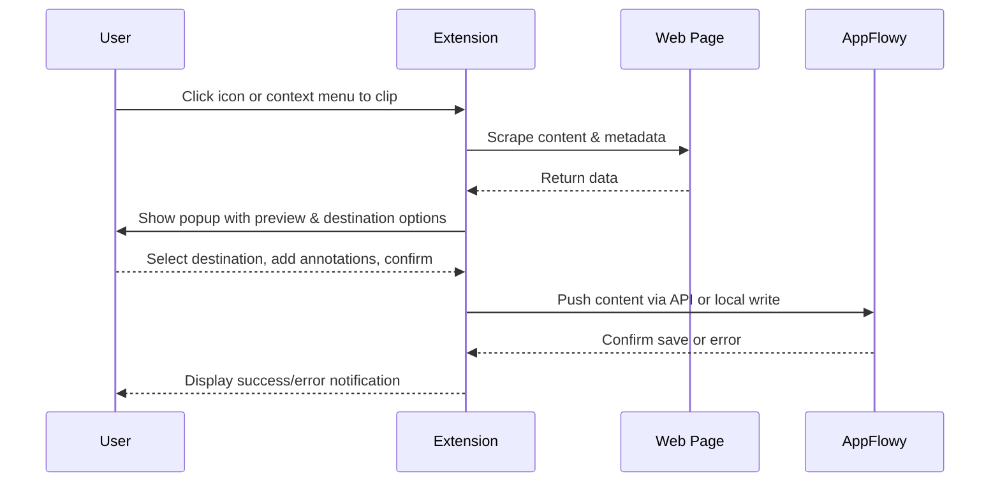
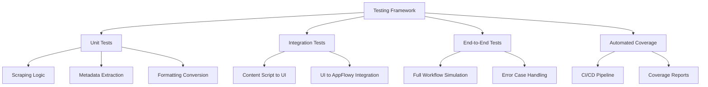

# Product Requirements Document (PRD) for AppFlowy Chrome Extension

## Introduction
### Purpose
This Product Requirements Document (PRD) defines the specifications for a Chrome extension designed for AppFlowy, a productivity tool focused on workspace organization. The extension aims to enable users to scrape web pages, including URLs, metadata (such as title, author, and publication date if available), and content, and seamlessly add this information to their AppFlowy environment with a single click. The goal is to provide a powerful, user-friendly web clipping tool that integrates with AppFlowy's structure, rivaling capabilities of established tools like Notion and Obsidian.

### Scope
The scope of this extension includes capturing web content, allowing user control over storage destinations within AppFlowy, preserving content formatting, and supporting annotations. It covers the full user journey from initiating a clip to saving content, with considerations for performance, security, and compatibility across various web environments and AppFlowy setups (local-first or cloud-based). This PRD outlines functional and non-functional requirements, user experience expectations, and a robust testing framework to ensure quality and reliability.

## User Stories
The following user stories illustrate the intended use cases and justify the feature set for the AppFlowy Chrome Extension:

- **As a researcher**, I want to clip articles from academic websites with one click, including metadata like author and publication date, so that I can organize my references in AppFlowy without manual copying.
- **As a student**, I want to highlight specific sections of lecture notes or online resources and save only those parts to AppFlowy, so that I can focus on relevant information for my studies.
- **As a content creator**, I want to save web pages with preserved formatting and add personal notes during clipping, so that I can reference styled content and my thoughts in AppFlowy for future projects.
- **As a project manager**, I want to choose specific AppFlowy workspaces or pages to save clipped content, so that it automatically integrates into my team's shared knowledge base.
- **As a casual user**, I want a simple, intuitive tool that previews clipped content before saving and notifies me when it's done, so that I can be confident my web captures are correct and saved.

## Functional Requirements
These requirements detail the specific functionalities the AppFlowy Chrome Extension must have to meet user needs:

- **One-Click Capture**:
  - The extension must provide a toolbar icon and context menu option to initiate full-page clipping with a single click.
  - It should capture all visible content on the current web page, including text, images, and embedded media where possible.

- **Destination Control**:
  - Users must be able to select specific AppFlowy workspaces, pages, or databases as the destination for clipped content via a popup interface.
  - The interface should display a list of available destinations fetched from AppFlowy (via API or local data access).
  - Default to the last used destination for subsequent clips to streamline repeated actions.

- **Precision Clipping**:
  - The extension must allow users to highlight specific text, images, or sections of a page via a selection tool or context menu.
  - Selected content must be captured accurately using DOM-based methods (e.g., CSS selectors or XPath) and saved as a distinct clip.

- **Metadata Inclusion**:
  - Automatically extract metadata from web pages, including title, URL, author, publication date, and other relevant data from HTML meta tags or Open Graph protocol.
  - Include extracted metadata as structured fields or prefixes in the saved content within AppFlowy.
  - Provide fallback text (e.g., "Unknown Author") when metadata is unavailable.

- **Formatting Preservation**:
  - Capture HTML structure and basic styling (e.g., headings, bold, italics, links) during clipping.
  - Convert captured content into a format compatible with AppFlowy's editor (e.g., markdown or rich text), maintaining as much original formatting as possible.

- **Annotation Support**:
  - Provide input fields in the popup for users to add custom notes, tags, or comments before saving.
  - Save annotations alongside the clipped content, either as separate fields or integrated text in AppFlowy.

- **Workflow Support**:
  - Display a preview of clipped content and metadata in the popup before saving, allowing users to edit or confirm.
  - Push content to the selected AppFlowy location upon confirmation, using API calls or direct file writes for local setups.
  - Show a success notification or error message post-save to confirm the action's outcome.

## Non-Functional Requirements
These requirements address quality attributes critical to the extension's performance and user experience:

- **Performance**:
  - The extension must complete scraping and display the popup preview within 3 seconds for typical web pages (under 5MB of content).
  - Minimize CPU and memory usage to avoid slowing down the browser, targeting less than 50MB memory footprint during operation.

- **Security and Privacy**:
  - Limit permissions to only necessary web content access (active tab) and AppFlowy integration endpoints.
  - Do not store or transmit user data beyond what is required for clipping and saving to AppFlowy.
  - Ensure secure handling of API tokens or authentication credentials if required for AppFlowy integration, using Chrome's secure storage mechanisms.

- **Compatibility**:
  - Support the latest three versions of Google Chrome to cover the majority of users.
  - Ensure functionality with both local-first and cloud-based AppFlowy setups, adapting integration methods as needed.
  - Handle a wide range of website structures, including dynamic content loaded via JavaScript, with graceful fallbacks for unsupported formats.

- **Testability**:
  - Design components to be modular, allowing for isolated unit testing of scraping, metadata extraction, and formatting logic.
  - Provide hooks or mock interfaces for integration testing between extension components and AppFlowy.
  - Enable end-to-end testing by simulating user interactions within a controlled browser environment.

## UI/UX Specifications
The user interface and experience must prioritize simplicity and intuitiveness, aligning with leading web clipping tools:

- **Popup Interface**:
  - A compact popup (approximately 400x500 pixels) triggered by the toolbar icon or context menu, displaying:
    - "Save" and "Cancel" buttons at the top for confirming or discarding the clip.
    - A dropdown or tree view for selecting AppFlowy destination (workspace/page).
    - A preview pane showing clipped content (scrollable for long content) and metadata.
    - Input fields for annotations (notes and tags).
  - Use a clean, modern design with AppFlowy branding (if available) or neutral colors for consistency.

- **Context Menu Access**:
  - Right-click context menu with options: "Clip Entire Page to AppFlowy" and "Clip Selection to AppFlowy" for quick access without opening the popup.
  - If "Clip Selection" is chosen, automatically capture highlighted content and open the popup for destination and annotation input.

- **Feedback Mechanism**:
  - Display a non-intrusive notification (toast message) near the toolbar icon upon successful save, e.g., "Content saved to [Page Name] in AppFlowy."
  - Show error notifications for failed saves, with a brief reason (e.g., "Failed to connect to AppFlowy") and a retry option.

- **Minimal Setup**:
  - Upon first use, prompt for minimal configuration if needed (e.g., AppFlowy connection setup), guiding users with clear instructions.
  - Store settings to avoid repeated setup, ensuring subsequent uses are frictionless.

Below is a Mermaid diagram illustrating the user workflow:

## Testing Requirements
A comprehensive test framework is essential to ensure the reliability, functionality, and performance of the AppFlowy Chrome Extension. The following testing strategy must be implemented:

- **Unit Tests**:
  - Test individual components in isolation, including:
    - Web scraping logic for full-page and precision clipping across various DOM structures.
    - Metadata extraction for different meta tag formats and Open Graph data.
    - Formatting conversion from HTML to AppFlowy-compatible formats.
  - Use a testing framework like Jest for JavaScript components, mocking DOM environments with tools like jsdom.

- **Integration Tests**:
  - Test interactions between components, such as:
    - Data flow from content script (scraping) to popup UI (preview).
    - Communication between extension and AppFlowy integration module (mocked API responses).
  - Validate that annotations and destination selections are correctly bundled with clipped content.

- **End-to-End Tests**:
  - Simulate complete user workflows using tools like Puppeteer or Playwright, including:
    - Clipping an entire page from a test website and saving to a mock AppFlowy destination.
    - Selecting specific content, adding annotations, and confirming via popup.
    - Handling error cases (e.g., failed AppFlowy connection).
  - Test across different website types (static, dynamic, media-heavy) to ensure broad compatibility.

- **Automated Test Coverage**:
  - Target at least 80% test coverage for critical components (scraping, integration, UI logic) to minimize untested code paths.
  - Use coverage tools integrated with the test framework (e.g., Jest's built-in coverage reports) to identify gaps.
  - Integrate testing into a CI/CD pipeline (e.g., GitHub Actions) to run automated tests on every code commit or pull request, ensuring regressions are caught early.

- **Test Scenarios**:
  - Define specific test cases for key features, such as:
    - Precision clipping on websites with nested DOM elements, ensuring only selected content is captured.
    - Metadata extraction from pages with missing or malformed meta tags, verifying fallback behavior.
    - Performance under load, clipping large pages (over 10MB) to ensure responsiveness within 3 seconds.
    - Error handling for failed API calls or unavailable AppFlowy instances, checking for user-friendly notifications.
  - Include cross-browser edge cases if future expansion beyond Chrome is considered.

- **Manual Testing**:
  - Conduct exploratory testing on popular websites (e.g., Wikipedia, Twitter, news outlets) to validate site-specific formatting rules.
  - Perform usability testing with a small user group to ensure UI intuitiveness and workflow clarity.

Below is a Mermaid diagram illustrating the testing framework structure:

## Success Metrics
The success of the AppFlowy Chrome Extension will be measured by the following metrics post-launch:
- **User Adoption**: Target 1,000 active users within the first 3 months after release on the Chrome Web Store.
- **Usage Frequency**: Average of at least 5 clips per active user per week, indicating regular utility.
- **Test Pass Rate**: Achieve a 95% or higher pass rate for automated tests during development and maintenance phases.
- **Coverage Metric**: Maintain at least 80% test coverage for critical components as reported by automated tools.
- **User Satisfaction**: Achieve an average rating of 4 out of 5 stars on the Chrome Web Store based on user reviews.
- **Bug Reports**: Keep critical bug reports (those affecting core clipping or saving functionality) below 5% of total user feedback in the first month post-launch.
- **Performance Benchmark**: Ensure 90% of users experience clipping and preview within 3 seconds, based on anonymized usage data if collected.

This PRD provides a comprehensive blueprint for the AppFlowy Chrome Extension, detailing the necessary features, quality standards, user experience expectations, and rigorous testing framework to ensure a high-quality, reliable product that meets user needs for web content capture and organization within AppFlowy.
